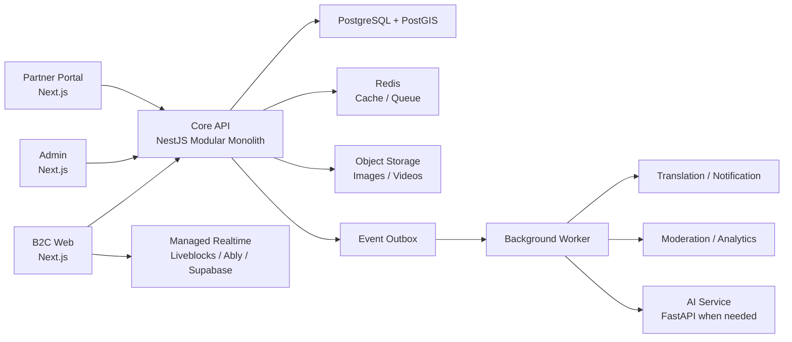

> ⚠️ **[ARCHIVED] 이 문서는 기획 참고 자료입니다.** 여기서 제안한 6개 앱 모노레포·NestJS·contracts 패키지 구조는 **채택되지 않았습니다** (단일 Next.js 앱으로 확정). 정본은 [place-link_architecture_baseline.md](../place-link_architecture_baseline.md)와 [place-link_development_guide.md](../place-link_development_guide.md)입니다. 단, 스키마 보강안(AuthIdentity, PlaceTranslation 등)과 Adapter 패턴은 정본에 채택되어 있습니다.

# place-link 최적 개발 구조 및 단계별 구현 전략

## 1. 문서 목적

이 문서는 place-link의 B2C 사용자 서비스, 운영자 백오피스, B2B 파트너 포털, AI, 실시간 협업, 예약·쿠폰 등 최종 확장 범위를 수용하기 위한 개발 구조를 정의한다.

기능을 축소한 MVP를 별도로 만드는 대신, 전체 시스템의 경계와 디렉터리 구조를 먼저 확정하고 의존성 순서에 따라 기능을 단계적으로 구현하는 것을 기본 원칙으로 한다.

---

## 2. 핵심 아키텍처 결정

place-link에는 다음 조합을 적용한다.

- Turborepo 기반 모노레포
- B2C, Admin, Partner 프론트엔드 분리
- 도메인 모듈형 백엔드(Modular Monolith)
- 단일 PostgreSQL 데이터베이스와 업무 영역별 논리 스키마 분리
- API와 비동기 Worker 분리
- AI 서비스는 독립 실행 가능한 경계로 사전 설계
- 지도, 인증, 번역, 스토리지, AI 공급자는 Adapter 패턴으로 격리

처음부터 모든 애플리케이션을 운영 환경에 배포할 필요는 없지만, `web`, `admin`, `partner`, `api`, `worker`, `ai`의 코드 경계는 먼저 구성한다.

초기부터 MSA를 적용하면 배포, 인증, 트랜잭션, 로깅, 장애 추적 비용이 지나치게 증가한다. 반대로 하나의 Next.js 애플리케이션에 모든 기능을 넣으면 Admin, Partner, Worker, Realtime 기능이 확장될 때 대규모 재구성이 필요하다. 따라서 독립 도메인 모듈을 가진 단일 API를 먼저 구축하고, 향후 필요한 모듈만 서비스로 분리할 수 있도록 설계한다.

---

## 3. 전체 시스템 구성



### 3.1. 애플리케이션 역할

| 애플리케이션 | 역할 |
|---|---|
| `web` | MZ 커플 및 글로벌 관광객용 B2C 모바일 웹 |
| `admin` | 장소, UGC, 회원, 번역, 쿠폰, 신고를 관리하는 운영 시스템 |
| `partner` | 사업자 인증, 매장 관리, 프로모션, 광고, 통계를 제공하는 B2B 포털 |
| `api` | 인증, 장소, 코스, 소셜, 보상, 예약 등 핵심 비즈니스 로직 |
| `worker` | 번역, 알림, 이미지 처리, 통계 집계, 모더레이션 등 비동기 작업 |
| `ai` | 자연어 코스 생성, 추천, 동선 최적화 등 Python 기반 기능 |

---

## 4. 권장 저장소 구조

패키지 관리는 `pnpm`, 빌드 및 작업 오케스트레이션은 `Turborepo`를 사용한다.

```text
placelink/
├─ apps/
│  ├─ web/                       # 고객용 모바일 웹
│  ├─ admin/                     # 운영자 백오피스
│  ├─ partner/                   # B2B 파트너 포털
│  ├─ api/                       # NestJS Core API
│  ├─ worker/                    # 비동기 작업 처리
│  └─ ai/                        # FastAPI, 초기에는 골격만 구성
│
├─ packages/
│  ├─ ui/                        # 공용 UI 컴포넌트
│  ├─ design-tokens/             # 색상, 타이포, 간격, 모션
│  ├─ contracts/                 # API 요청·응답 타입과 Zod schema
│  ├─ api-client/                # OpenAPI 기반 생성 클라이언트
│  ├─ database/                  # Prisma, migrations, seed
│  ├─ auth/                      # 인증 Provider Adapter
│  ├─ i18n/                      # Locale, 번역 키, 포맷
│  ├─ maps/                      # Kakao, Naver, Google 지도 Adapter
│  ├─ storage/                   # S3, Supabase Storage Adapter
│  ├─ observability/             # Logger, tracing, error reporting
│  ├─ config/                    # ESLint, TypeScript, Tailwind 설정
│  └─ testing/                   # 테스트 fixture와 공용 도구
│
├─ tooling/
│  ├─ scripts/
│  └─ generators/
│
├─ infra/
│  ├─ docker/
│  ├─ compose/
│  └─ deployment/
│
├─ docs/
│  ├─ product/
│  ├─ architecture/
│  ├─ adr/                       # 주요 기술 결정 기록
│  ├─ api/
│  └─ existing-designs/
│
├─ .github/
│  └─ workflows/
├─ package.json
├─ pnpm-workspace.yaml
├─ turbo.json
└─ README.md
```

Vercel은 하나의 Git 저장소에 있는 여러 애플리케이션을 각각의 프로젝트로 연결하고, workspace 의존성에 따라 변경되지 않은 애플리케이션의 배포를 건너뛸 수 있다.

---

## 5. 프론트엔드 구조

각 Next.js 애플리케이션은 URL과 레이아웃을 정의하는 `app` 영역과 실제 기능을 구현하는 `features` 영역을 분리한다.

```text
apps/web/src/
├─ app/
│  ├─ [locale]/
│  │  ├─ (marketing)/
│  │  ├─ (explore)/
│  │  ├─ (course-builder)/
│  │  ├─ (community)/
│  │  └─ (account)/
│  ├─ api/                       # BFF가 꼭 필요한 경우만 사용
│  └─ layout.tsx
│
├─ features/
│  ├─ auth/
│  ├─ places/
│  ├─ courses/
│  ├─ discovery/
│  ├─ social/
│  ├─ rewards/
│  └─ profile/
│
├─ widgets/
├─ components/
├─ hooks/
└─ lib/
```

### 5.1. 프론트엔드 구현 원칙

- `page.tsx`에 데이터 접근과 비즈니스 로직을 집중시키지 않는다.
- Server Component를 기본으로 사용한다.
- 지도, 드래그 앤 드롭, 실시간 편집처럼 상호작용이 필요한 부분만 Client Component로 만든다.
- Zustand는 코스 작성 중 임시 상태처럼 실제 클라이언트 전역 상태에만 사용한다.
- 서버 데이터는 Server Component 캐시 또는 TanStack Query로 관리한다.
- `web`, `admin`, `partner`는 화면 전체가 아니라 원자 UI와 디자인 토큰만 공유한다.
- Route Group으로 마케팅, 탐색, 코스 작성, 커뮤니티, 계정 레이아웃을 분리한다.

---

## 6. 백엔드 도메인 구조

`apps/api`는 기술 단위가 아니라 업무 기능 단위로 모듈을 구성한다.

```text
apps/api/src/modules/
├─ identity/          # 사용자, 인증 연결, 권한
├─ couples/           # 커플 연결, 프로필, D-Day
├─ places/            # 장소 마스터, 외부 지도 ID, 중복 병합
├─ courses/           # 코스, 노드, 작성, 발행
├─ discovery/         # 피드, 검색, 추천, 명예의 전당
├─ social/            # 팔로우, 댓글, 리액션, 신고
├─ media/             # 이미지 업로드 및 변환
├─ localization/      # 번역 생성 및 검수
├─ rewards/           # 캠페인, 쿠폰, 업적
├─ bookings/          # 예약과 결제 상태
├─ partners/          # 사업자, 매장 소유권, 광고
├─ moderation/        # 콘텐츠 검수와 제재
├─ notifications/     # 푸시, 이메일, 알림톡
└─ analytics/         # 이벤트와 운영 지표
```

각 모듈 내부는 다음 네 계층으로 통일한다.

```text
courses/
├─ domain/            # 엔티티, 정책, 불변 조건
├─ application/       # Use Case
├─ infrastructure/    # Prisma, 외부 API
├─ presentation/      # Controller, DTO
└─ courses.module.ts
```

### 6.1. API 원칙

- `web`, `admin`, `partner`는 데이터베이스를 직접 조회하지 않는다.
- 모든 외부 접근은 Core API 계약을 통한다.
- REST API와 OpenAPI를 기본으로 사용한다.
- 프론트엔드는 OpenAPI에서 생성한 `packages/api-client`를 사용한다.
- API 경로는 `/v1` 형태로 버전을 명시한다.
- 목록 API는 offset보다 cursor pagination을 우선한다.
- 예약, 결제, 쿠폰 발급에는 idempotency key를 적용한다.
- 도메인 간 비동기 후속 작업은 Outbox Event로 전달한다.

---

## 7. 데이터베이스 구조

데이터베이스는 PostgreSQL 하나를 사용하되 업무 영역별 schema로 논리적으로 분리한다.

| PostgreSQL schema | 주요 데이터 |
|---|---|
| `identity` | User, AuthIdentity, Couple, Role |
| `catalog` | Place, PlaceProviderRef, PlaceTranslation, PlaceImage |
| `content` | Course, CourseNode, CourseTranslation, Tag, MediaAsset |
| `social` | Follow, Comment, Reaction, Scrap, Report |
| `commerce` | Partner, Campaign, Coupon, Booking, Payment |
| `ops` | AdminAction, AuditLog, FeatureFlag, Notification |
| `analytics` | Event, AggregatedMetric |

Prisma의 multi-schema 기능을 사용하며 Prisma schema 자체도 도메인별 여러 파일로 분리한다.

### 7.1. 기존 설계에서 보강할 사항

- `name_kr`, `name_en` 컬럼 대신 `PlaceTranslation` 테이블을 사용한다.
- `translated_tip JSON`만 사용하지 않고 번역 상태와 검수 이력을 별도 관리한다.
- 단일 `source_id` 대신 `PlaceProviderRef(provider, externalId)`를 사용한다.
- 사용자와 로그인 공급자를 분리하고 Kakao, Google, Apple ID는 `AuthIdentity`에 저장한다.
- 주소 문자열보다 canonical `Place.id`와 위경도를 관계의 기준으로 사용한다.
- 예약과 쿠폰처럼 중복 요청에 민감한 기능은 `idempotencyKey`를 지원한다.
- 관리자 변경 사항은 `AuditLog`에 기록한다.
- 비동기 이벤트 유실을 방지하기 위해 `OutboxEvent`를 사용한다.
- 장소 반경 검색은 PostGIS 공간 인덱스를 사용한다.
- PostGIS 고유 타입과 공간 쿼리는 migration SQL과 TypedSQL 또는 raw SQL 영역으로 격리한다.
- 모든 테이블에 일괄적으로 soft delete를 넣지 않고, 복원이 필요한 도메인에만 명시적으로 적용한다.

---

## 8. 외부 서비스 Adapter 구조

외부 공급자를 화면이나 도메인 코드에서 직접 호출하지 않는다.

```ts
interface PlaceSearchProvider {
  search(query: PlaceSearchQuery): Promise<ExternalPlace[]>;
  nearby(query: NearbyQuery): Promise<ExternalPlace[]>;
}

interface DirectionsProvider {
  getRoute(input: RouteInput): Promise<RouteResult>;
}

interface TranslationProvider {
  translate(input: TranslationInput): Promise<TranslationResult>;
}

interface CourseGenerator {
  generate(input: CoursePrompt): Promise<CourseDraft>;
}
```

예상 구현체는 다음과 같다.

- `KakaoPlaceProvider`
- `NaverPlaceProvider`
- `GooglePlaceProvider`
- `GoogleTranslationProvider`
- `DeepLTranslationProvider`
- `OpenAICourseGenerator`

AI는 임의의 장소 이름과 주소를 최종 데이터로 생성해서는 안 된다. AI는 조건에 맞는 후보와 코스 초안을 생성할 수 있지만, 발행되는 코스의 모든 장소는 canonical `Place.id`와 연결되어야 한다.

---

## 9. 인증 및 권한

- 인증 공급자는 Adapter 뒤에 배치해 교체 가능하게 한다.
- 서비스 내부 `User`와 외부 로그인 계정을 분리한다.
- API가 발급자와 audience를 검증한 뒤 사용자 컨텍스트를 생성한다.
- Admin과 Partner 권한은 단순 화면 숨김이 아니라 서버의 RBAC 정책으로 강제한다.
- 주요 관리자 작업은 행위자, 대상, 변경 전후 값을 Audit Log에 기록한다.
- 파트너는 인증된 사업장에 대해서만 관리 권한을 가진다.

---

## 10. 비동기 작업 및 실시간 기능

다음 작업은 사용자 요청 처리 과정에서 동기 실행하지 않고 Queue와 Worker로 전달한다.

- UGC 다국어 번역
- 이미지 리사이징과 썸네일 생성
- 유해 이미지 및 텍스트 검수
- 푸시, 이메일, 알림톡 전송
- 조회수와 추천 지표 집계
- 쿠폰 발급 후속 작업
- AI 코스 생성 및 임베딩 처리

커플 공동 편집은 독립적인 Realtime Adapter를 사용한다. 초기에는 Liveblocks, Ably, Supabase Realtime 등 관리형 서비스를 고려하고, 도메인 데이터의 최종 저장은 Core API가 책임진다.

---

## 11. 배포 구조

현재 구성된 Vercel `placelink` 프로젝트는 `apps/web`의 배포 프로젝트로 사용한다.

| 배포 단위 | 권장 배포 위치 | 역할 |
|---|---|---|
| `placelink-web` | Vercel | B2C 서비스 |
| `placelink-admin` | Vercel | 운영자 백오피스 |
| `placelink-partner` | Vercel | 파트너 포털 |
| `placelink-api` | 컨테이너 플랫폼 | NestJS API |
| `placelink-worker` | 컨테이너 플랫폼 | Queue Worker |
| `placelink-ai` | 컨테이너 또는 GPU 환경 | Python AI 작업 |
| PostgreSQL | Supabase, RDS, Neon 등 | 메인 데이터베이스 |
| Redis | Upstash, ElastiCache 등 | Queue와 Cache |
| Storage | S3, Supabase Storage 등 | 이미지와 영상 |

`web`, `admin`, `partner`는 동일한 GitHub 저장소를 각각 별도의 Vercel 프로젝트로 연결하고 각 프로젝트의 Root Directory를 지정한다.

`api`와 `worker`는 Queue Consumer, WebSocket, 장시간 실행 작업을 고려하여 Vercel 프론트엔드 프로젝트와 분리한다.

---

## 12. 단계별 구현 순서

아래 단계는 MVP를 위한 기능 축소가 아니라 전체 구조를 유지한 상태에서 의존성 순서대로 구현하는 계획이다.

### 0단계: 기반 골격

- 모노레포와 전체 애플리케이션 디렉터리 생성
- 공용 TypeScript, ESLint, Tailwind, 테스트 설정
- 환경 변수 schema 및 실행 시 검증 구성
- CI, Preview 배포, 로깅, 오류 추적 구성
- Architecture Decision Record 작성 규칙 수립
- 로컬 PostgreSQL 및 Redis Docker 환경 구성

### 1단계: 플랫폼 핵심 모델

- 사용자, 인증, 권한
- 커플 프로필
- 장소 마스터와 Provider Mapping
- 코스와 코스 노드
- 미디어와 번역 모델
- Admin 장소·사용자·코스 관리 기반 기능

### 2단계: 핵심 사용자 경험

- 홈, 탐색, 검색
- 지도와 주변 장소
- 코스 생성 마법사
- 코스 상세, 공유, SEO
- 스크랩과 명예의 전당
- 한국어·영어 라우팅

### 3단계: 소셜 및 실시간 기능

- 팔로우, 댓글, 리액션
- 신고와 모더레이션
- 알림
- 커플 공동 편집
- GPS 체크인과 업적

### 4단계: B2B 및 수익화

- 파트너 인증
- 캠페인과 쿠폰
- 광고 슬롯
- 예약, 바우처, 결제
- 파트너 분석 대시보드
- 정산과 감사 로그

### 5단계: AI 및 고급 추천

- 자연어 코스 생성
- 동선 최적화
- 개인화 피드
- 번역과 모더레이션 자동화
- 추천 품질 측정과 A/B 테스트

---

## 13. 테스트 전략

| 테스트 유형 | 대상 |
|---|---|
| Unit | 도메인 정책, 계산, Formatter, Adapter 변환 |
| Integration | PostgreSQL, Prisma Repository, Queue, 외부 API Adapter |
| Contract | OpenAPI 요청·응답과 생성 클라이언트 호환성 |
| Component | 주요 React 컴포넌트와 상태 전환 |
| E2E | 로그인, 장소 선택, 코스 발행, 공유, 관리자 검수 |

- Unit 및 Component 테스트는 빠른 피드백을 위해 Vitest 기반으로 구성한다.
- DB 통합 테스트는 실제 PostgreSQL과 PostGIS 환경을 사용한다.
- 핵심 사용자 흐름은 Playwright로 검증한다.
- 외부 지도와 번역 API는 Adapter Contract Test를 둔다.
- 결제와 쿠폰은 재시도 및 중복 요청 시나리오를 반드시 검증한다.

---

## 14. Git, CI/CD 및 환경 관리

- `main` 브랜치는 항상 배포 가능한 상태를 유지한다.
- 작업은 짧은 Feature Branch와 Pull Request로 통합한다.
- Pull Request마다 Vercel Preview를 생성한다.
- Production, Staging, Preview 데이터베이스를 분리한다.
- DB Migration은 Preview 배포마다 무조건 실행하지 않고 별도 승인된 작업으로 실행한다.
- API 계약 변경은 OpenAPI 호환성 검사를 통과해야 병합한다.
- 모노레포의 영향 범위에 따라 필요한 앱과 패키지만 빌드하고 테스트한다.
- 비밀 값은 Git에 저장하지 않고 배포 환경별 Secret Store에서 관리한다.
- 서버 전용 키는 `NEXT_PUBLIC_*` 환경 변수에 저장하지 않는다.

---

## 15. 보안 및 개인정보 원칙

- 위치 정보와 GPS 체크인은 명시적 동의를 받은 경우에만 수집한다.
- 위치 원본 데이터의 보존 기간과 삭제 정책을 정의한다.
- 커플 연결과 해제 시 상대방 데이터 접근 권한을 재평가한다.
- Admin, Partner, User API의 인가 정책을 분리한다.
- 업로드 파일은 MIME, 크기, 악성 콘텐츠 검사를 수행한다.
- 코스 작성, 댓글, 신고, 로그인 API에는 Rate Limit을 적용한다.
- 결제·예약 Webhook은 서명 검증과 멱등 처리를 수행한다.
- 로그에 Access Token, 개인정보, 정확한 위치 좌표를 그대로 기록하지 않는다.

---

## 16. 최초 실행 작업

1. GitHub `whitederrick/placelink` 저장소를 로컬 작업 폴더와 연결한다.
2. pnpm과 Turborepo 기반 루트 workspace를 구성한다.
3. `apps/web`, `apps/admin`, `apps/partner`, `apps/api`, `apps/worker`, `apps/ai` 골격을 생성한다.
4. 공용 `config`, `contracts`, `database`, `ui`, `observability` 패키지를 생성한다.
5. PostgreSQL과 Redis 로컬 개발 환경을 구성한다.
6. 기존 Vercel `placelink` 프로젝트의 Root Directory를 `apps/web`으로 설정한다.
7. GitHub Actions에서 lint, typecheck, unit test, build 검증을 구성한다.
8. 인증, 장소, 코스 도메인부터 데이터 모델과 API 계약을 작성한다.

---

## 17. 참고 문서

- [Vercel: Using Monorepos](https://vercel.com/docs/monorepos)
- [Vercel: Projects Overview](https://vercel.com/docs/projects)
- [Next.js: Project Structure](https://nextjs.org/docs/app/getting-started/project-structure)
- [Next.js: App Router](https://nextjs.org/docs/app)
- [Prisma: Multi-schema](https://docs.prisma.io/docs/orm/prisma-schema/data-model/multi-schema)
- [Prisma: PostgreSQL Extensions](https://docs.prisma.io/docs/postgres/database/postgres-extensions)

