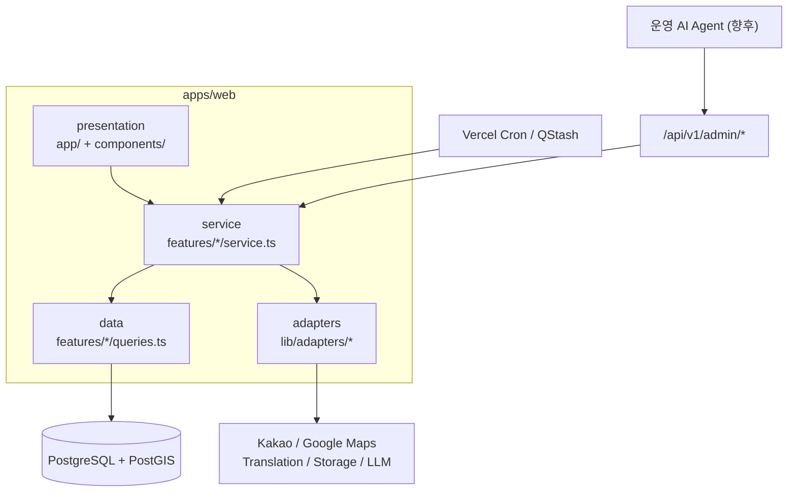

# place-link 확정 아키텍처 기준 (Architecture Baseline) v1.0

## 1. 문서 위상

이 문서는 place-link의 **기술 결정("어떻게 만드는가")의 단일 기준**이다.

- 제품 요구사항("무엇을 만드는가")은 [place-link_product_baseline.md](place-link_product_baseline.md)를 따른다.
- 개발 규칙은 [place-link_development_guide.md](place-link_development_guide.md)(이하 "가이드")를 따른다.
- 기존 문서 5종(기획안, detailed/advanced/ultimate design, development_architecture)은 `docs/legacy/`로 이동했으며 **기획 참고 자료**다. 충돌 시 본 문서와 가이드가 우선한다.
- 본 문서의 결정을 변경하려면 ADR(`docs/adr/`)을 작성한다.

## 2. 핵심 결정 요약

| 항목 | 결정 | 배제한 대안 |
|---|---|---|
| 애플리케이션 | **Next.js(App Router) 풀스택 단일 앱** | 6개 앱 분리, NestJS/Spring 별도 백엔드 |
| 저장소 | pnpm + Turborepo **최소 모노레포** | 단일 패키지, 풀 모노레포(contracts/api-client 등) |
| DB | PostgreSQL + PostGIS (Supabase) | MySQL, MongoDB |
| ORM | Prisma | — |
| 배포 | Vercel + Supabase | 컨테이너 인프라 자체 운영 |
| 백오피스 | 같은 앱의 `/admin` route group + RBAC | 별도 admin 앱 |
| 비동기 작업 | 상태 기반 큐 테이블 + Vercel Cron/QStash | 전용 worker 앱, Redis 큐 |
| 인증 | Auth.js(NextAuth) — Kakao/Google, `AuthIdentity` 분리 | — |
| 상태 관리 | Server Component 기본 + TanStack Query, Zustand는 코스 빌더 임시 상태만 | — |
| API 스타일 | REST `/api/v1/*`, Zod 단일 스키마 | OpenAPI codegen, GraphQL, Server Action |
| UI 다국어 | next-intl — 모든 UI 문구는 번역 키 경유 (가이드 CON-8) | 하드코딩 문구 |
| 관측성 | Sentry + pino 구조화 로깅 (10장) | — |

**설계 철학**: 물리적 분리는 뒤로 미루고, 논리적 경계(계층·feature·adapter)는 처음부터 강제한다. 분리 비용을 결정하는 것은 앱 개수가 아니라 의존성 방향이다 (가이드 ARCH-1~6).

## 3. 저장소 구조

```text
placelink/
├─ apps/
│  └─ web/                        # 유일한 앱. B2C + admin 포함
│     ├─ src/
│     │  ├─ app/
│     │  │  ├─ [locale]/          # ko/en 라우팅 (Day 1 요건)
│     │  │  │  ├─ (home)/
│     │  │  │  ├─ courses/
│     │  │  │  └─ my/
│     │  │  ├─ admin/             # 백오피스. 별도 레이아웃 + RBAC 미들웨어
│     │  │  └─ api/v1/            # 모든 변이·클라이언트 조회 API
│     │  ├─ features/             # 도메인 로직 (가이드 PROD-4 구조 고정)
│     │  │  ├─ auth/  couples/  places/  courses/
│     │  │  ├─ discovery/  social/  moderation/  rewards/
│     │  │  └─ ops/               # AuditLog, 운영 큐, 에이전트 승인
│     │  ├─ components/           # 전역 공용 UI
│     │  ├─ lib/
│     │  │  ├─ adapters/          # maps / translation / storage / llm 인터페이스+구현
│     │  │  ├─ auth/              # Actor 컨텍스트, 토큰 검증 (프레임워크 독립)
│     │  │  ├─ api/               # withApiHandler, AppError, 표준 응답
│     │  │  ├─ shared/            # feature 간 공유 코드 승격 위치
│     │  │  └─ env.ts
│     │  └─ styles/
│     └─ e2e/                     # Playwright
├─ packages/
│  ├─ database/                   # Prisma schema, migrations, seed
│  └─ config/                     # tsconfig, eslint, prettier, tailwind preset
├─ docs/
│  └─ adr/
├─ .github/
│  ├─ workflows/ci.yml
│  └─ PULL_REQUEST_TEMPLATE.md
├─ CLAUDE.md                      # AI 세션 준용 장치 (가이드 AGT-5)
├─ pnpm-workspace.yaml
└─ turbo.json
```

모노레포를 최소로 유지하는 이유: `database`/`config` 분리는 향후 앱 분리 시 재사용의 핵심이고, 그 이상의 패키지 분할은 현 시점에 왕복 비용만 발생시킨다.

## 4. 계층 구조



- service는 프레임워크와 무관한 순수 TypeScript로 유지한다 (가이드 ARCH-3). 이것이 API 서버 분리·에이전트 도구화·worker 분리를 모두 가능하게 하는 단일 장치다.

## 5. 데이터베이스 원칙

기존 설계 대비 확정 채택 사항 (스키마는 되돌리기 가장 비싼 결정이므로 처음부터 적용):

1. **`AuthIdentity` 분리** — User와 소셜 로그인 계정(provider, externalId)을 분리.
2. **`PlaceTranslation` 테이블** — `name_kr`/`name_en` 컬럼 방식 금지. 언어 추가가 스키마 변경이 되지 않게 한다.
3. **`PlaceProviderRef(provider, externalId)`** — 단일 `source_id` 금지. 카카오/구글/TourAPI 병행 매핑.
4. **번역 상태 관리** — `translated_tip JSON` 캐싱 대신 상태(`MACHINE → REVIEWED`)와 검수 이력을 가진 레코드 (가이드 INT-4, AGT-2).
5. **`AuditLog`** — Day 1부터. actorType(HUMAN/AGENT) 포함 (가이드 AGT-4).
6. **운영 큐 테이블** — Report, TranslationReview, PlaceMergeCandidate, ModerationItem은 상태 필드를 가진 대기열로 설계.
7. **멱등키** — 쿠폰/예약 계열 테이블은 `idempotencyKey` 유니크 제약 (가이드 INT-3).
8. **PostGIS** — 반경/뷰포트 검색은 공간 인덱스 + `$queryRaw` 격리 (가이드 QRY-5).
9. 카운터 컬럼은 원본 테이블에서 재계산 가능하게 유지 (가이드 QRY-7).
10. **행동 이벤트 수집** — `Event(userId, name, properties, createdAt)` append-only 테이블을 단계 2부터 운영 (가이드 ANL). 향후 개인화 추천(단계 5)의 학습·신호 데이터가 된다. 태그는 자유 문자열 배열이 아니라 관리형 `Tag` 테이블 + 조인으로 저장 (가이드 ANL-5).
11. **출처(Provenance) 기록** — 모든 Place·행사 레코드는 `sourceType(PUBLIC_API | BUSINESS | EDITOR | UGC)`과 원본 참조(`PlaceProviderRef`)를 가진다 (가이드 INT-7). 소스별로 검수 정책이 다르며(product baseline 5.1), 출처는 신뢰도 표시·파트너 정산의 근거다.
12. **행사성 데이터 분리** — 팝업·전시처럼 기간이 있는 정보는 상설 `Place`에 컬럼을 얹지 않고 별도 모델(`Happening` — 분석용 `Event` 테이블과 명칭 구분)로 분리한다. `placeId` + `startsAt/endsAt` + 상태(`UPCOMING | ACTIVE | ENDED`)를 가지며, 만료 처리는 상태 기반 배치(INT-4 패턴)로 수행한다. 앵커 지정은 Happening 단위로 한다.
13. **수집 파이프라인** — 외부 데이터(공공/기업)는 ① raw 스테이징 저장 → ② 정규화 → ③ canonical Place/Happening 병합의 3단계로 처리한다. 원본을 보존해야 가공 로직 변경 시 재처리가 가능하다. 동기화는 cron으로 실행하고, 중복 의심 건은 자동 병합하지 않고 운영 큐(PlaceMergeCandidate)로 보낸다.

논리 스키마(multi-schema) 분리는 **보류** — 단일 schema로 시작하고, 테이블이 30개를 넘거나 앱 분리 시점에 도입을 재검토한다.

## 6. AI Agent 운영 설계

에이전트는 별도 시스템이 아니라 **운영 API를 호출하는 또 하나의 클라이언트**다.

- **API 우선 백오피스**: 모든 운영 행위는 service + `/api/v1/admin/*`로 먼저 구현, admin UI는 껍데기 (가이드 ARCH-6). 이 API 집합이 곧 에이전트 도구 목록이 된다.
- **큐 기반 운영**: 에이전트의 작업 단위는 "대기열 항목을 판단하고 처리 API 호출" (가이드 AGT-2).
- **행위 등급**: 자동 실행(번역 검수, 앵커 추천, 고확신 스팸 블라인드) vs 제안 후 인간 승인(제재, 병합, 금전 관련) (가이드 AGT-3).
- **도입 순서**: ① 사람이 admin UI로 운영 → ② Claude Code 등 에이전트에 운영 API를 도구로 부여해 수동 감독 하에 실행 → ③ 검증된 업무만 cron 자동화로 승격.

## 7. 단계별 구현 순서

| 단계 | 내용 | 완료 기준 |
|---|---|---|
| **0. 골격** | 모노레포, lint/CI/훅 등 준용 장치 전체(가이드 ENF-1), env 검증, DB 로컬 환경, seed, Sentry·로깅(10장), next-intl, 환경 매트릭스(9장) | `pnpm verify` + CI 그린, 스캐폴드 feature 1개로 계층 규칙 lint 검증 |
| **1. 코어 도메인** | AuthIdentity 인증, Couple, Place(+ProviderRef/Translation), Course/Node, AuditLog | 시드 데이터로 코스 CRUD API 동작 |
| **2. 핵심 UX** | 홈/피드, 지도 주변 탐색, 코스 마법사, 상세/공유(OG), 스크랩, 명예의 전당, ko/en, **행동 이벤트 로깅(ANL)** | E2E 스모크(가이드 REG-2) 통과 + **SEO 요건(11장) 충족** |
| **3. 운영·에이전트 기반** | admin UI, 신고/모더레이션/번역검수 큐, 승인 게이트, 운영 API 완비 | 모든 운영 행위가 API로 수행 가능 |
| **4. 성장 기능** | 팔로우/댓글, 알림, 업적, 쿠폰(멱등키) | — |
| **5. 확장** | **개인화 추천(규칙 기반 → 검증 후 ML)**, AI 코스 생성(adapter 경유), 파트너, 예약/결제 | 각각 착수 전 ADR |

각 단계는 이전 단계의 완료 기준을 만족한 뒤 시작한다. 단계 내 기능은 가이드 PROD-1(DoR)에 따라 스키마·API 계약 확정 후 구현한다.

## 8. 물리 분리 트리거

미리 분리하지 않는 대신, 아래 신호가 오면 그때 분리한다. 경계 규칙(ARCH)이 지켜져 있는 한 각 분리는 재작성이 아니라 이동이다.

| 신호 | 조치 |
|---|---|
| cron 작업이 요청 처리 리소스를 잠식 | `apps/worker` 분리 (service 재사용) |
| admin 배포 주기·권한 요구가 분화 | `apps/admin` 분리 |
| 웹 외 클라이언트(앱, 파트너)가 API 소비 | API 서버 분리 + contracts 패키지 도입 |
| B2B 제휴 실계약 발생 | `apps/partner` 신설 |
| LLM 기능이 Python 생태계 필요 | `apps/ai` (FastAPI) 신설, CourseGenerator adapter 구현체 교체 |
| Event 볼륨이 메인 DB를 압박 | 이벤트를 외부 분석 스토어(BigQuery 등)로 이관, `track()` 진입점은 유지 |

## 9. 환경 및 배포 파이프라인

| 환경 | 앱 | DB | 마이그레이션 |
|---|---|---|---|
| **local** | `pnpm dev` | Docker PostgreSQL(PostGIS) 또는 Supabase CLI 로컬 | `prisma migrate dev` 자유 |
| **preview** | Vercel Preview (PR마다) | **전용 preview DB** (prod와 완전 분리, 시드 데이터) | PR의 마이그레이션을 preview DB에 자동 적용 |
| **production** | Vercel Production | Supabase production | CI의 **수동 승인 스텝**에서만 `prisma migrate deploy` 실행 |

- Preview가 production DB에 연결되는 구성은 금지한다. 환경별 접속 정보는 배포 플랫폼 Secret에만 존재한다 (가이드 SEC-5).
- 마이그레이션은 앱 배포와 분리된 파이프라인 스텝이다: 마이그레이션 승인·실행 → 앱 배포 순서. Expand–Contract(가이드 REG-4)와 결합하면 롤백 가능한 배포가 된다.
- 배포 실패 시 롤백 절차: 앱은 Vercel 이전 배포로 즉시 롤백, DB는 롤백하지 않고 forward-fix(정정 마이그레이션)를 원칙으로 한다.

## 10. 관측성 및 백업

에이전트 운영의 전제 조건이다 — 에이전트의 행위 결과를 시스템이 관측할 수 없으면 자동화를 확대할 수 없다.

- **에러 트래킹**: Sentry (web 클라이언트 + 서버 모두). 0단계에서 세팅한다.
- **로깅**: 구조화 JSON 로깅(pino). `console.log` 금지, `lib/logger` 단일 진입점. 로깅 금지 항목은 가이드 SEC-8.
- **핵심 지표 알림**: 5xx 비율, 마이그레이션 실패, cron(수집·만료 처리) 실패는 알림 채널(Slack/텔레그램)로 즉시 통지한다.
- **제품 지표**: product baseline 9장의 지표는 행동 이벤트(ANL) 기반으로 집계한다. 별도 분석 도구 도입은 보류.
- **백업·복구**: Supabase 자동 백업 + PITR(Point-in-Time Recovery) 활성화. 초기 목표 RPO 24시간 / RTO 4시간. 복구 절차는 1단계 완료 시점에 1회 실제 리허설로 검증한다.

## 11. SEO 기술 요건 (단계 2 완료 기준에 포함)

SEO는 성장 루프의 절반이므로(product baseline 4장) 기능이 아니라 완료 기준으로 취급한다.

- `sitemap.xml` 자동 생성 (코스 상세 포함), `robots.txt`
- ko/en **hreflang** 상호 참조 태그 — 글로벌 Day 1 요건
- 코스 상세: OG 태그(제목·대표 이미지·팁 요약) SSR 생성 + schema.org 구조화 데이터(JSON-LD)
- 공유 URL은 영구 불변 (slug 변경 시 301 리다이렉트 유지)

## 12. 보류 목록 (명시적 비채택)

다음은 "안 하는 것"이 결정 사항이다. 도입하려면 ADR 필요:
NestJS/Spring 별도 백엔드, OpenAPI codegen, Redis, 전용 worker, MSA, Prisma multi-schema, 실시간 동시 편집, AR, 파트너 포털, 인앱 결제, Server Action.
